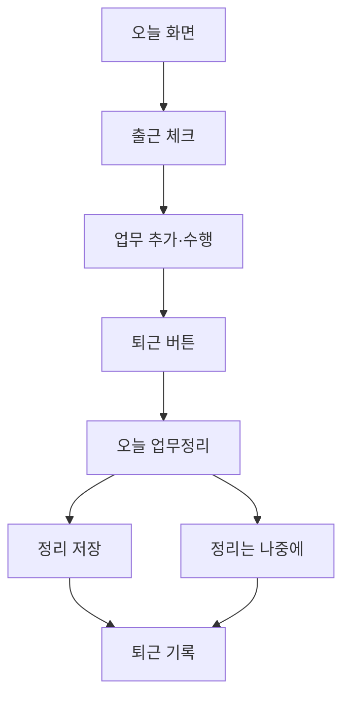

# HR 대시보드 PRD

- 문서 버전: v1.0
- 작성일: 2026-09-14
- 문서 목적: 직원의 출퇴근, 휴가, 일별 업무와 업무 이관을 통합 관리하는 웹 서비스의 개발 기준
- 제품명: HR & Work Dashboard — 개발용 가칭
- 1차 제공 형태: PC·모바일 브라우저에서 사용하는 반응형 웹
- 우선순위: P0 = 첫 출시 필수, P1 = 후속 확장

## 1. 제품 목표

직원은 매일 출근을 기록하고, 업무를 추가·수행하며, 퇴근 전에 진행 상황을 정리한다. 관리자는 한 화면에서 직원별 출퇴근 여부, 휴가 일정, 업무 진행 상황과 확인이 필요한 기록을 파악한다.

업무는 여러 날에 걸쳐 이어질 수 있는 독립된 항목으로 관리한다. 담당자가 바뀌어도 동일한 업무 ID와 변경 이력을 유지하며, 새 담당자는 이전 내용과 진행 상황을 이어받는다.

### 1.1 사용자가 요청한 핵심 범위

| 요청 | 구현 기준 |
| --- | --- |
| 출퇴근 기록 | 직원이 매일 출근·퇴근 버튼을 눌러 서버 시각으로 기록 |
| 매일 업무 추가 | 오늘 날짜를 기본값으로 업무를 생성하고 내 업무에 표시 |
| 퇴근 전 진행 상황 정리 | 퇴근 동작에서 오늘 업무 확인·상태 변경·일일 메모 작성 제공 |
| 업무 필드 | 이름, 담당자, 참조자, 상세내용, 진행상태 |
| 업무 상태 | 준비중, 진행중, 완료, 취소됨 |
| 업무 이관 | 다른 직원으로 담당자를 변경하고 이력·알림 기록 |
| 휴가 사전 등록 | 날짜·종일/반차를 등록하고 개인·조직 일정에 반영 |
| 휴가 관리자 알림 | 휴가 등록·변경·취소 시 관리자 알림 생성 |
| 어드민 대시보드 | 전체 직원의 근태·휴가·업무 현황 조회 |

### 1.2 완료된 제품에서 가능한 일

1. 직원이 모바일에서 출근을 기록하고 오늘 할 업무를 추가한다.
2. 업무 상태를 변경하고 필요한 동료를 참조자로 지정한다.
3. 업무를 다른 직원에게 이관하면 해당 직원의 내 업무에 즉시 나타난다.
4. 퇴근 시 오늘 업무를 확인하고 완료·진행중 등의 상태를 정리한다.
5. 휴가를 미리 등록하면 관리자 알림과 휴가 캘린더에 반영된다.
6. 관리자는 오늘 근무중인 직원, 퇴근한 직원, 휴가자, 출퇴근 미체크자와 업무정리 미완료자를 확인한다.

## 2. MVP 기본 결정

아래는 개발을 진행하기 위한 기본값이다. 회사의 실제 운영 규칙이 전달되면 설정값 또는 후속 범위로 변경한다.

| 항목 | MVP 결정 |
| --- | --- |
| 운영 대상 | 단일 조직, 직원·관리자 두 가지 역할 |
| 계정 생성 | 관리자가 직원을 초대하는 방식, 공개 회원가입 없음 |
| 로그인 | 이메일 기반 인증; 구체적인 인증 제공자는 구현 환경에 맞춰 선택 |
| 시간대 | Asia/Seoul; 실제 이벤트 시각은 UTC로 저장 |
| 기본 근무일·시간 | 월~금 09:00~18:00, 휴게 12:00~13:00; 관리자 설정 가능 |
| 휴무일 | 관리자가 지정한 조직 휴무일·공휴일 목록 사용 |
| 휴가 처리 | 승인 없는 등록제; 저장 즉시 등록 완료·일정 반영·관리자 알림 |
| 반차 기본 구간 | 오전반차 09:00~14:00, 오후반차 14:00~18:00; 휴게 제외 각 4시간 예시이며 설정 가능 |
| 알림 채널 | 서비스 내부 알림함·읽지 않은 알림 배지 |
| 퇴근 전 업무정리 | 기본 안내 흐름으로 제공하되 미완료 업무나 정리 생략 때문에 퇴근 기록을 차단하지 않음 |
| 업무 공개 범위 | 작성자·현재 담당자·참조자·관리자만 조회 |
| 일일 출퇴근 | 근무일당 출근 1회·퇴근 1회; 외출·복귀·분할 근무 제외 |
| 휴가 사용량 | 등록된 종일 1일·반차 0.5일 기준의 운영상 집계; 연차 발생·법정 잔여일수 계산 제외 |
| 기술 제약 | 실제 DB 저장과 서버 권한 검증 필수; 특정 프레임워크·호스팅 서비스로 고정하지 않음 |

휴가 승인, 외부 메시지 발송, 법정 연차 계산은 사용자 요청으로 확정된 기능이 아니다. 첫 출시에는 위 기본값을 적용한다.

## 3. 범위와 우선순위

| 기능 | 우선순위 | 포함 내용 |
| --- | --- | --- |
| 계정·직원 관리 | P0 | 초대, 로그인, 이름·부서·역할 관리, 계정 비활성화 |
| 직원 홈 | P0 | 출퇴근 버튼, 오늘 업무, 업무정리, 예정 휴가, 알림 |
| 출퇴근 기록 | P0 | 서버 시각 저장, 중복 방지, 본인 기록 조회 |
| 근태 정정 | P0 | 직원 정정 요청, 관리자 반영·반려, 원본·이력 보존 |
| 업무 관리 | P0 | 생성, 조회, 수정, 네 가지 상태, 검색·필터 |
| 업무 이관 | P0 | 담당자 변경, 인수인계 메모, 관계자 알림·이력 |
| 업무 협업 | P0 | 여러 참조자, 댓글, 변경 이력 |
| 일일 업무정리 | P0 | 상태 확인, 일일 메모, 제출 시점 스냅샷 |
| 휴가 | P0 | 종일·오전반차·오후반차, 사전 등록·변경·취소, 캘린더 |
| 관리자 현황 | P0 | 일별 근태, 기간별 직원 상세, 휴가, 업무, 확인 필요 목록 |
| 내부 알림 | P0 | 휴가·배정·이관·정정 결과·업무정리 안내 |
| 내보내기 | P1 | 권한 범위에 따른 근태·휴가·업무 CSV 다운로드 |
| 휴가 승인·잔여량 | P1 | 신청·승인·반려, 수동 부여량과 잔여량, 별도 정책 설계 |
| 외부 알림 | P1 | 이메일·Slack·카카오 등 회사가 선택한 채널 |
| 업무 확장 | P1 | 마감일, 우선순위, 첨부파일, 하위 업무, 프로젝트, 반복 업무, 칸반 드래그 |
| 근태 확장 | P1 | 직원별 유연근무, 교대근무, 외출·복귀, GPS·IP 제한, 급여 연동 |

## 4. 역할과 접근 권한

모든 권한은 서버에서 검사한다. 화면에서 버튼을 숨기는 것만으로 권한을 구현하지 않는다. 모든 데이터는 조직 경계 안에서만 접근할 수 있다.

| 작업 | 직원 | 관리자 |
| --- | --- | --- |
| 출근·퇴근 체크 | 본인만 | 본인만; 타인 기록은 정정 기능으로 처리 |
| 근태 상세 조회 | 본인 | 조직 전체 |
| 과거 근태 수정 | 정정 요청만 가능 | 사유를 남기고 반영 가능 |
| 휴가 등록·변경·취소 | 본인, 허용된 날짜 범위 | 전체; 대리 처리 사유 필수 |
| 휴가 사유·개인별 사용량 조회 | 본인 | 조직 전체 |
| 조직 휴가 캘린더 | 이름·부서·날짜·종일/반차만 조회 | 사유 포함 상세 조회 |
| 직원 선택용 목록 | 활성 직원의 이름·부서·선택용 ID | 직원 관리 상세까지 조회 |
| 업무 생성 | 가능; 활성 직원 누구에게나 최초 배정 가능 | 가능 |
| 업무 조회·댓글 | 작성자·현재 담당자·참조자일 때 | 전체 |
| 업무 이름·상세·참조자·예정일 수정 | 작성자 또는 현재 담당자 | 전체 |
| 업무 상태 변경·이관 | 현재 담당자 | 전체 |
| 일일 업무정리 조회 | 본인 | 조직 전체 |
| 알림 읽음 처리 | 본인 알림만 | 본인 알림만 |
| 직원·권한·조직 정책 관리 | 불가 | 가능 |

추가 규칙:

- 참조자는 여러 명 지정할 수 있으며 댓글을 남길 수 있다. 참조자 자격만으로 업무 수정·상태 변경·이관은 할 수 없다.
- 업무 작성자는 이관 이후에도 조회·댓글 및 위 표의 내용 수정 권한을 유지한다. 담당자 권한은 현재 담당자에게만 있다.
- 이관 전 담당자는 자동으로 참조자에 추가한다. 이후 참조자에서 제거되면 작성자·관리자가 아닌 한 해당 업무 접근 권한을 잃는다.
- 읽기 권한이 사라진 업무의 알림·검색 결과는 업무 내용과 상세를 노출하지 않는다. 과거 본인의 업무정리 스냅샷은 제출 당시 본인의 기록으로 보존한다.
- 직원 비활성화 전 미완료 담당 업무를 다른 활성 직원에게 이관해야 한다. 마지막 활성 관리자는 비활성화하거나 직원으로 강등할 수 없다.
- 비활성 직원의 과거 근태·업무 이력은 유지하고 신규 로그인·배정·참조자 추가를 차단한다.

## 5. 화면 구조와 주요 흐름

### 5.1 공통 내비게이션

- 직원 메뉴: `오늘` / `업무` / `휴가` / `내 기록`.
- 관리자에게 `관리자` 메뉴를 추가한다. 관리자 화면 내부에서 근태·업무·휴가·직원·설정을 전환한다.
- 알림함과 내 프로필은 공통 상단 영역에 둔다.
- 모바일에서는 핵심 메뉴와 출퇴근 동작을 쉽게 누를 수 있게 하고 표는 카드 또는 가로 스크롤로 전환한다.

### 5.2 직원의 하루

업무 등록과 조회는 출근 전이나 퇴근 후에도 가능하다. 업무 시스템 사용 시각으로 출퇴근을 자동 생성하지 않는다.

### 5.3 오늘 화면

| 영역 | 내용·행동 |
| --- | --- |
| 근태 카드 | 오늘 날짜, 현재 근태 상태, 출근·퇴근 시각, 출근/퇴근 버튼 |
| 오늘 내 업무 | 오늘 대상으로 계산된 담당 업무, 상태별 개수, 빠른 상태 변경, 업무 추가 |
| 오늘 업무정리 | 미정리/제출완료 표시, 일일 메모, 제출·보기 버튼 |
| 예정 휴가 | 본인의 가까운 휴가, 휴가 등록 바로가기 |
| 알림 | 새 업무 배정·이관·휴가 변경 등 읽지 않은 알림 |

### 5.4 업무 화면

- 기본 탭은 `내 담당 업무`, 보조 필터는 `내가 만든 업무`, `참조 업무`다.
- 표 기본 열: 업무 ID, 이름, 담당자, 참조자, 상태, 업무 예정일, 최종 변경 시각.
- 이름·업무 ID 검색, 상태·담당자·예정일 필터, 최근 변경순 정렬을 제공한다.
- 업무 클릭 시 상세 패널 또는 상세 페이지를 연다. 필드, 댓글, 이관 버튼, 시간순 변경 이력을 표시한다.
- 완료·취소 업무도 검색할 수 있다. 기본 미완료 목록에서는 숨기고 상태 필터로 조회한다.

### 5.5 내 기록·휴가 화면

- 내 기록: 월별 출퇴근 목록, 날짜별 상세, 업무정리, 정정 요청 현황.
- 휴가: 월 캘린더와 내 휴가 목록, 등록·변경·취소, 선택 기간 사용량.
- 조직 휴가 캘린더는 협업 일정 파악에 필요한 정보만 표시한다.

## 6. 업무 기능 명세

### 6.1 업무 필드

| 필드 | 필수 | 정의·기본값 |
| --- | --- | --- |
| 업무 ID | 자동 | 조직 내 고유하고 변경되지 않는 식별자; 화면 예: TASK-1024 |
| 이름 | 필수 | 공백 제거 후 1~150자 |
| 담당자 | 필수 | 활성 직원 1명; 기본값 생성자 본인 |
| 참조자 | 선택 | 활성 직원 0명 이상; 중복 금지, 현재 담당자는 참조자로 중복 저장하지 않음 |
| 상세내용 | 선택 | 최대 10,000자; 기본은 일반 텍스트와 링크 표시 |
| 진행상태 | 필수 | 준비중 / 진행중 / 완료 / 취소됨; 기본 준비중 |
| 업무 예정일 | 필수 | 업무를 시작할 날짜; 기본 조직 기준 오늘 |
| 작성자 | 자동 | 최초 생성자; 이후 변경 불가 |
| 생성·변경 시각 | 자동 | 서버 시각 |
| 완료·취소 시각 | 자동 | 해당 상태 진입 시 기록; 전체 전환 이력은 별도 보존 |

과거 예정일로 업무를 기록하는 것은 허용하지만 과거 출퇴근 기록이나 과거 제출된 업무정리를 자동 수정하지 않는다.

### 6.2 생성·변경

- 직원은 하루에 여러 업무를 만들 수 있다. 등록 즉시 담당자 목록에 반영한다.
- 다른 직원에게 최초 배정하면 해당 직원에게 알림을 생성한다. 본인 배정에는 본인 배정 알림을 만들지 않는다.
- 하나의 업무를 날짜마다 복제하지 않는다. 전날의 준비중·진행중 업무는 다음 날에도 같은 ID로 이어진다.
- 이름·상세내용·담당자·참조자·상태·예정일의 변경 전후 값과 행위자를 남긴다.
- 사용자가 업무를 삭제하는 기능은 MVP에 두지 않는다. 중단된 업무는 취소됨으로 전환한다.

### 6.3 상태 전환

| 현재 상태 | 가능한 다음 상태 | 조건 |
| --- | --- | --- |
| 준비중 | 진행중, 완료, 취소됨 | 담당자 또는 관리자; 취소 시 사유 필수 |
| 진행중 | 준비중, 완료, 취소됨 | 담당자 또는 관리자; 취소 시 사유 필수 |
| 완료 | 준비중, 진행중 | 담당자 또는 관리자; 재개 사유 필수 |
| 취소됨 | 준비중, 진행중 | 담당자 또는 관리자; 재개 사유 필수 |

- 취소와 재개 사유는 1~1,000자다. 일반적인 상태 변경에서 긴 보고서를 요구하지 않는다.
- 완료와 취소됨 사이의 직접 변경은 허용하지 않는다. 재개한 뒤 필요한 상태로 변경한다.
- 완료·취소 업무를 재개하면 현재 종료 시각을 비우되 이전 종료 이벤트는 변경 이력에 남긴다.
- 상태 변경만으로 담당자·예정일·다른 업무의 상태를 자동 변경하지 않는다.

### 6.4 업무 이관

이관은 업무를 복사하는 동작이 아니라 동일한 업무의 담당자를 교체하는 동작이다.

1. 현재 담당자 또는 관리자가 상세 화면에서 `업무 이관`을 누른다.
2. 같은 조직의 다른 활성 직원 1명을 선택한다.
3. 인수인계 메모 1~2,000자를 입력한다. 화면에서 현재 상황·다음 할 일·주의사항 예시를 안내한다.
4. 저장 시 담당자 변경, 이전 담당자 참조자 추가, 새 담당자 참조자 중복 제거, 이관 이력과 알림 이벤트를 한 트랜잭션으로 저장한다.
5. 새 담당자의 내 업무에 표시하고, 이전 담당자의 미완료 담당 목록에서는 제외한다.

규칙:

- 새 담당자의 수락 절차 없이 저장 즉시 이관한다. 수락·거절 흐름은 후속 확장이다.
- 상태·예정일·상세내용·댓글·업무 ID를 유지한다.
- 완료·취소됨 업무는 먼저 재개해야 이관할 수 있다.
- 본인에게 다시 이관하거나 비활성 직원에게 이관할 수 없다.
- 새 담당자·이전 담당자·작성자·현재 참조자에게 알림을 보내되 같은 사람은 1회만, 실행자는 제외한다.
- 일반 업무 수정 API로 담당자만 바꿔 이관 이력을 우회할 수 없도록 담당자 변경은 전용 명령으로 처리한다.
- 이관에 수반된 참조자 추가는 별도의 참조자 추가 알림을 발생시키지 않는다. 이관 알림 1건으로 안내한다.

## 7. 일별 업무와 퇴근 전 정리

### 7.1 오늘 업무의 선정 기준

조직 현지 날짜 D에 다음 업무를 합쳐 중복 없이 표시한다.

1. 현재 본인 담당이고 예정일이 D 이하인 준비중·진행중 업무.
2. 현재 본인 담당이고 예정일이 D인 업무. 완료·취소됨도 당일에는 표시한다.
3. D에 본인이 생성·수정·상태 변경·댓글·이관을 수행한 업무 중 현재 조회 권한이 있는 업무.

- 미래 예정 업무는 예정일에 도달하기 전까지 기본 오늘 목록에 넣지 않는다. 단, 오늘 직접 활동했다면 표시한다.
- 과거 날짜의 업무정리 화면은 제출 스냅샷을 표시한다. 현재 담당자·상태로 과거 보고서를 다시 구성하지 않는다.
- 이관된 업무의 오늘 활동은 `오늘 이관한 업무`로 구분하고 새 담당자에게만 현재 상태 변경 권한을 준다.

### 7.2 정리 UI와 저장

- 퇴근 버튼을 누르면 오늘 업무 목록, 상태 선택, 일일 메모, `정리 저장 후 퇴근` 및 `정리는 나중에 하고 퇴근`을 표시한다.
- 미완료 업무를 억지로 완료 처리하지 않는다. 진행중·준비중 상태 그대로 정리 제출할 수 있다.
- 업무가 없다면 `오늘 등록된 업무 없음`을 확인하고 빈 목록으로 제출할 수 있다.
- 일일 메모는 선택이며 최대 3,000자다. 예: 오늘 수행한 일, 막힌 점, 다음 근무일 할 일.
- 업무별 상태 변경은 일반 상태 변경 권한·사유 규칙을 동일하게 적용한다.
- 제출 시 포함된 업무의 ID·이름·담당자·상태·업무 버전과 제출자를 스냅샷으로 저장한다.
- 업무정리는 직원·근무일 기준 1건이며 재제출하면 새 버전을 남긴다. 기존 제출 버전은 덮어쓰지 않는다.
- 퇴근 이후나 다음 날에도 해당 근무일의 정리를 제출할 수 있다. 실제 제출 시각을 남기고 `사후 작성`으로 표시한다.
- 과거 근무일을 정리할 때 현재 업무 상태를 과거 시점으로 되돌리지 않는다. 이전 제출이 없으면 작성자가 현재 권한이 있는 업무를 선택하고 해당 날짜의 수행 내용을 메모로 남긴다.

### 7.3 퇴근 기록과의 관계

- 업무정리 저장과 출퇴근 저장은 독립된 기능이다. 정리 오류·상태 충돌이 발생해도 `정리는 나중에 하고 퇴근`을 제공한다.
- 정리 저장 후 퇴근 요청이 실패하면 정리 내용은 보존하고 퇴근만 재시도한다.
- 정리 생략은 `업무정리 미완료`로 표시한다. 생략을 제출완료로 집계하지 않는다.
- 퇴근을 기록한 뒤에도 업무 수정은 가능하다. 이후 변경은 실시간 업무·이력에 반영되며 이미 제출된 정리에는 재제출 전까지 반영하지 않는다.
- 이미 퇴근 기록이 있는 날에 다시 정리해도 퇴근 시각을 갱신하지 않는다.

### 7.4 업무정리 안내

- 남아 있는 예정 근무 구간의 종료 30분 전, 출근 기록이 있고 아직 퇴근·정리 제출이 없는 직원에게 내부 알림을 1회 생성한다.
- 오후반차가 있으면 남아 있는 근무 구간의 종료 시각을 기준으로 안내한다.
- 종일 휴가·휴무일에는 안내하지 않는다. 앱을 열지 않은 상태에서도 알림함에는 저장하되 이메일·문자·푸시는 MVP에서 보내지 않는다.
- 근무일 종료 이후 관리자는 정리 미완료를 확인할 수 있다. 정리 제출 여부를 업무 생산성 점수로 환산하지 않는다.

## 8. 출퇴근 기능 명세

### 8.1 출근

- 로그인한 직원이 본인 출근을 기록한다. 요청 본문으로 타인의 사용자 ID를 지정할 수 없다.
- 기록 시각은 서버 시각이며, 브라우저 시각은 저장값으로 신뢰하지 않는다.
- 조직 시간대에서 출근한 날짜를 `work_date`로 저장하고 해당 날짜 근무정책 버전을 연결한다.
- 사용자·근무일당 출근 1건, 사용자당 종료되지 않은 기록 1건을 보장한다.
- 정상 저장 응답을 받은 후에만 화면을 근무중으로 표시한다. 연결 실패 시 기록 성공으로 표시하지 않는다.
- 종일 휴가·휴무일 출근은 확인 안내 후 허용한다. 휴가를 자동 취소하지 않고 관리자 확인 항목으로 표시한다.

### 8.2 퇴근

- 열려 있는 본인 출근 기록에 퇴근 시각을 저장한다. 출근 기록이 없으면 퇴근을 새로 만들지 않고 정정 요청을 안내한다.
- 버튼 연타·재시도는 최초 성공 기록을 반환한다. 이미 저장된 퇴근 시각을 새 시각으로 덮어쓰지 않는다.
- 자정을 넘어 퇴근해도 원래 출근일의 기록을 닫는다. 화면에 `전일 YYYY-MM-DD 출근 기록의 퇴근 처리`를 명확히 표시한다.
- 자정에 자동 퇴근시키거나 새로운 근무일 기록으로 분리하지 않는다.
- 출근 후 24시간을 초과한 열린 기록은 `장시간 미종료·정정 필요`로 표시하고 일반 퇴근 대신 정정 요청으로 처리한다. 이는 MVP의 기록 오류 방지 기준이며 법정 근로시간 기준이 아니다.
- 이전 기록이 열려 있으면 신규 출근을 막고 해당 기록의 퇴근 또는 정정을 먼저 안내한다.

### 8.3 근무 구간과 근태 분류

- 조직의 근무일·휴무일·출퇴근 기준·휴게·반차 구간으로 날짜별 예정 근무 구간을 만든다.
- 등록된 휴가가 차지하는 구간을 제외한 나머지가 실제 체크 대상 구간이다.
- 근태 분류는 원본 출퇴근 시각, 해당 날짜 정책, 현재 유효 휴가를 조합하여 계산한다. 분류 때문에 원본 시각을 수정하지 않는다.
- 지각은 출근 기록이 있고 실제 출근이 남은 첫 예정 근무 시작보다 늦은 경우다. 허용 여유 시간 기본값은 0분이며 관리자 설정값을 적용한다.
- 아직 출근하지 않은 사람은 `미체크`로 표시한다. 출근 기록이 없다는 이유만으로 결근이나 지각을 확정하지 않는다.

오늘의 직원별 기본 상태는 아래 순서로 하나만 부여한다. 휴가·지각·미정리 등은 별도 배지다.

| 우선순위 | 조건 | 기본 상태 |
| --- | --- | --- |
| 1 | 이전 근무일에 종료되지 않은 출근 기록이 있음 | 기록 확인 필요 |
| 2 | 오늘 출근 기록이 있고 퇴근 기록이 없음 | 근무중 |
| 3 | 오늘 출근·퇴근 기록이 모두 있음 | 퇴근 |
| 4 | 조직 휴무일이고 오늘 출퇴근 기록이 없음 | 휴무 |
| 5 | 예정 근무 구간 전체가 유효 휴가로 제외되고 기록이 없음 | 휴가 |
| 6 | 체크 대상 구간이 있고 현재가 시작 시각 전이며 출근 기록 없음 | 출근 예정 |
| 7 | 체크 대상 구간 시작 이후이며 출근 기록 없음 | 미체크 |

과거 날짜 화면은 해당 근무일의 저장된 출퇴근 기록과 정책·휴가로 계산한다. 다른 날짜의 현재 열린 기록을 과거 기본 상태에 끼워 넣지 않는다.

### 8.4 시간 표시

- `체류시간 = 퇴근 시각 - 출근 시각`.
- `참고 근무시간 = 체류시간 - 실제 출퇴근 구간과 겹치는 설정 휴게시간`.
- 퇴근이 없는 기록은 진행 시간으로만 보여주며 완료된 기간 합계에 포함하지 않는다.
- 자정을 넘는 기록은 출근 날짜의 예정 휴게 구간과 겹치는 시간만 공제한다. 다른 날의 점심시간을 임의로 추가 공제하지 않는다.
- 시간 값은 서버에서 분 단위로 계산하고 음수·퇴근이 출근보다 이른 값은 허용하지 않는다.
- 화면에 `참고 근무시간`으로 표시한다. 급여·수당·연장근로·법정 근로시간을 계산하는 기능은 포함하지 않는다.

### 8.5 정정 요청과 관리자 처리

- 직원은 본인의 누락 출근·퇴근 또는 잘못된 시각에 대해 대상 근무일, 희망 시각, 사유를 제출한다.
- 상태: 접수 → 반영 또는 반려. 같은 직원·근무일에 접수 상태 요청은 1건만 허용한다.
- 관리자는 요청 내용, 기존 기록, 충돌 여부를 확인하고 사유와 함께 반영·반려한다.
- 반영 시 기존 값·새 값·행위자·사유·시각을 남긴다. 기록이 없었다면 정정으로 생성했음을 표시한다.
- 정정값도 시간 순서, 근무일 유일성, 다른 근무 기록과의 시간 중복을 검증한다. 정정은 24시간 제한을 넘는 기록도 사유와 함께 처리할 수 있다.
- 대상 기록이 요청 이후 변경되었으면 관리자에게 최신 값으로 재검토를 요청한다. 오래된 요청으로 새 기록을 덮어쓰지 않는다.
- 반영·반려 결과를 요청자에게 알리고 관리자 확인 목록에서 제거한다.

## 9. 휴가 기능 명세

### 9.1 등록 필드

| 필드 | 필수 | 정의 |
| --- | --- | --- |
| 사용자 | 자동 | 직원은 본인; 관리자는 대리 등록 대상 선택 가능 |
| 시작일·종료일 | 필수 | 조직 기준 날짜; 오늘부터 미래 날짜까지 |
| 사용 단위 | 필수 | 종일, 오전반차, 오후반차 |
| 사유 | 선택 | 최대 2,000자; 본인과 관리자만 조회 |
| 관리자 대리 처리 사유 | 조건부 | 관리자가 타인 휴가를 등록·변경·취소하면 필수 |
| 상태 | 자동 | 등록 / 취소; 승인대기 상태 없음 |
| 생성·변경 시각 | 자동 | 서버 시각 |

- 종일 휴가는 연속 날짜 범위로 등록한다. 범위 안의 조직 휴무일은 사용일수에서 제외한다.
- 반차는 MVP에서 하루만 선택할 수 있다. 여러 날의 반차는 각각 등록한다.
- 실제 적용 근무일이 없는 범위는 저장하지 않고 날짜 재선택을 안내한다.
- 저장 전에 적용 날짜, 제외된 휴무일, 종일/반차, 합계 사용일수를 미리 보여준다.
- 과거 날짜 등록·정정은 관리자만 사유와 함께 처리한다.

### 9.2 중복·수정·취소

- 동일 직원의 유효 휴가가 같은 날짜·같은 구간에 겹치면 저장을 거절한다. 종일은 오전·오후를 모두 점유한다.
- 같은 날짜에 오전반차와 오후반차를 각각 등록하는 것은 허용하며 합계 1일로 표시한다.
- 직원은 아직 시작하지 않은 휴가 구간을 변경·취소할 수 있다. 시작된 구간이 있는 요청 전체의 변경·취소는 관리자에게 요청한다.
- 이미 근태 기록이 있는 날짜에 휴가를 추가하거나 휴가 중 출퇴근이 발생하면 해당 구간의 겹침을 표시하고 관리자에게 확인 알림을 생성한다.
- 휴가·근태의 겹침은 업무상 예외일 수 있으므로 휴가 저장이나 실제 출퇴근 자체를 자동 취소하지 않는다.
- 취소 시 삭제하지 않고 취소 상태·취소자·취소 시각·사유를 보존한다.
- 수정 시 기존 버전과 새 버전을 보존하고 캘린더·사용량·관련 근태 배지를 다시 계산한다.

### 9.3 관리자 알림

- 휴가 저장 성공 시 모든 활성 관리자에게 내부 알림을 생성한다. 특정 승인 담당자 지정은 MVP에 없다.
- 알림 항목: 직원 이름, 휴가 날짜, 종일/오전반차/오후반차, 사용일수, 등록·변경·취소 구분, 상세 링크.
- 휴가 사유는 알림 미리보기에 노출하지 않고 권한이 있는 상세 화면에서만 확인한다.
- 관리자가 자기 휴가 또는 타인 휴가를 등록한 경우에도 관리자 수신 기록은 남긴다. 본인이 실행한 알림은 읽음 상태로 생성한다.
- 관리자 대리 처리 시 대상 직원에게도 알림을 생성한다. 한 이벤트의 동일 수신자 알림은 1건으로 합친다.
- 알림 발송 처리 장애가 휴가 저장을 취소시키지 않는다. 휴가와 알림 이벤트를 같은 트랜잭션으로 저장하고 알림 생성은 재시도한다.
- 정상 상태에서 저장 후 1분 안에 관리자 알림함에 나타나는 것을 목표로 한다. 캘린더는 저장 성공 직후 새 조회에 반영되어야 한다.

### 9.4 휴가 사용량 표시

- 선택 기간 내 등록 상태 휴가의 실제 적용일 기준으로 과거·오늘 사용량과 미래 예정량을 분리해 표시한다.
- 취소된 휴가와 휴무일은 집계에서 제외한다. 월을 넘는 휴가는 각 날짜가 속한 월에 나눠 집계한다.
- 휴가 중 출근 기록이 있어도 등록 휴가 사용량을 자동 차감하지 않는다. 충돌 표시 후 관리자가 휴가를 정정하면 재계산한다.
- 조직 정책의 종일·반차 단위를 집계하는 값이며, 잔여 연차·법정 연차 발생량을 뜻하지 않는다.

## 10. 관리자 대시보드

### 10.1 오늘 요약

기준 날짜는 조직 기준 오늘이며 날짜·부서 필터를 제공한다.

| 영역 | 표시 내용 |
| --- | --- |
| 기본 근태 상태 | 근무중, 퇴근, 휴가, 휴무, 출근 예정, 미체크, 기록 확인 필요 |
| 확인 필요 | 전일 퇴근 미체크, 장시간 미종료, 근태 정정 요청, 휴가·근태 겹침 |
| 업무정리 | 제출완료, 근무 종료 후 미완료, 사후 작성 |
| 오늘 업무 | 직원별 준비중·진행중·완료·취소 개수, 오늘 상태 변경·이관 활동 |
| 휴가 일정 | 오늘 휴가자, 가까운 예정 휴가, 최근 등록·변경·취소 |

- 기본 근태 상태는 상호 배타적으로 집계하여 합계가 조회 대상 직원 수와 일치해야 한다.
- 지각·반차·정리 미완료·휴가 충돌 배지는 기본 상태에 추가되는 항목이며 기본 상태 합계에 더하지 않는다.
- 과거 조회는 해당 날짜에 재직한 직원을 대상으로 한다. 비활성화된 직원도 해당 날짜에 재직했다면 과거 조회에 포함한다.

### 10.2 직원별 근태 표

기본 열: 이름, 부서, 기본 상태, 출근 시각, 퇴근 시각, 참고 근무시간, 휴가 구간, 지각 여부, 업무정리 상태, 확인 필요 사유.

- 행 클릭 시 해당 직원의 날짜 상세와 업무정리·업무·정정 이력을 연다.
- 이름·부서·날짜 범위·기본 상태·정정 필요·정리 미완료 필터를 제공한다.
- 자동으로 미체크를 결근으로 바꾸거나 기록이 없는 날을 0시간 근무로 확정하지 않는다.

### 10.3 업무 현황

- 직원별 현재 담당 업무를 네 가지 상태로 집계한다.
- `오늘 활동`과 `현재 담당 업무 누계`를 별도 표기해 오늘 완료 수와 누적 완료 수를 혼동하지 않도록 한다.
- 이관은 현재 담당 업무 집계에서 새 담당자에게 귀속한다. 과거 수행·완료·이관 활동은 당시 행위자와 담당자 스냅샷을 유지한다.
- 업무 개수나 완료율을 근무시간·개인 생산성 평가 점수로 자동 환산하지 않는다.

### 10.4 관리 기능

- 직원 초대·역할·부서·입사일·계정 비활성화 관리.
- 조직 근무일·시간·휴게·반차·휴무일·지각 여유 시간 관리.
- 근무정책은 적용 시작일과 버전을 둔다. 새 정책은 기본적으로 다음 날 이후 적용하고 과거 기록의 기준을 소급 변경하지 않는다.
- 정책 저장 시 시작·종료·휴게 구간의 순서와 중복을 검사한다. 반차 구간은 휴게를 제외한 예정 근무시간을 겹침 없이 절반씩 나누도록 설정한다. 야간 교대 시간표는 MVP에서 설정하지 않는다.
- 미래 근무정책·휴무일을 바꾸면 이미 등록된 미래 휴가의 적용 구간·사용량과 예정 알림 시각을 함께 재계산한다. 변경 전 영향 받는 휴가를 관리자에게 보여주고, 사용일수나 구간이 바뀐 직원·관리자에게 변경 알림을 남긴다.
- 이미 시작된 날짜의 정책·휴무일은 일반 설정에서 변경하지 않는다. 과거 오류는 해당 근태·휴가의 관리자 정정으로 처리한다.
- 신규 초대는 한 번의 명시적 초대 동작으로 인증 제공자의 초대 메일을 보낸다. 직원 데이터 수정만으로 초대 메일을 재발송하지 않는다.

## 11. 알림과 변경 이력

### 11.1 이벤트별 알림

| 이벤트 | 수신자 | 비고 |
| --- | --- | --- |
| 다른 직원에게 업무 최초 배정 | 새 담당자 | 본인 배정 제외 |
| 업무 참조자 추가 | 새로 추가된 참조자 | 실행자 제외 |
| 업무 이관 | 새·이전 담당자, 작성자, 참조자 | 중복·실행자 제외 |
| 업무 상태 변경 | 작성자, 담당자, 참조자 | 중복·실행자 제외 |
| 업무 댓글 | 작성자, 담당자, 참조자 | 중복·실행자 제외 |
| 휴가 등록·변경·취소 | 활성 관리자 전체 | 대리 처리 대상 직원 포함; 실행자 처리 규칙은 9.3 적용 |
| 근태·휴가 겹침 | 본인과 활성 관리자 | 동일 충돌·동일 버전 중복 방지 |
| 근태 정정 요청 | 활성 관리자 전체 | 요청 상세 링크 |
| 근태 정정 반영·반려 | 요청 직원 | 처리 결과·사유 |
| 퇴근 전 업무정리 안내 | 조건을 충족한 본인 | 직원·근무일당 1회 |

### 11.2 신뢰성

- 알림은 읽음·안읽음과 생성 시각을 가진다. 다른 사용자의 알림은 읽거나 읽음 처리할 수 없다.
- 도메인 데이터 변경과 알림 이벤트 저장은 같은 트랜잭션에서 처리한다.
- 이벤트별 수신자 목록을 확정하고 `(이벤트 ID, 수신자 ID)`를 유일하게 관리한다.
- 작업 처리기는 미처리 이벤트를 재시도하고 성공 수신자를 중복 생성하지 않는다. 반복 실패는 운영자가 조회할 수 있다.
- 알림·상세 링크를 열 때 현재 권한을 다시 검사한다. 알림에 저장된 링크만으로 접근을 허용하지 않는다.
- 출퇴근 정정, 업무 상태·담당자 변경, 휴가 변경, 계정 역할 변경은 추가 전용 감사 기록에 남긴다.

## 12. 데이터 모델

아래는 논리 스키마다. 구현 시 관계형 DB와 마이그레이션으로 관리하고 조직·권한 조건을 모든 조회에 적용한다.

| 엔터티 | 주요 필드 | 주요 제약 |
| --- | --- | --- |
| organizations | id, name, timezone | 시간대 기본 Asia/Seoul |
| users | id, organization_id, auth_id, name, email, department_id, role, active, employment_start_date, employment_end_date, deactivated_at | 인증 ID 고유; 조직 내 이메일 중복 금지 |
| departments | id, organization_id, name | 비활성 직원의 과거 부서 표시는 이력·스냅샷 보존 |
| work_policies | id, organization_id, effective_from, work_weekdays, work_start, work_end, breaks, half_day_intervals, grace_minutes, version | 조직·적용일 고유; 날짜별 적용 버전 결정 |
| holidays | id, organization_id, date, name | 조직·날짜 고유 |
| attendance_records | id, organization_id, user_id, work_date, check_in_at, check_out_at, policy_id, created_source, version | 사용자·근무일 고유; 열린 기록 사용자당 1건 |
| attendance_correction_requests | id, organization_id, user_id, work_date, target_record_id, target_record_version, requested_times, reason, status, reviewed_by, review_reason, reviewed_at | 동일 사용자·근무일 접수 상태 요청 1건 |
| tasks | id, organization_id, task_key, title, description, creator_id, assignee_id, planned_date, status, completed_at, cancelled_at, version, timestamps | 조직·task_key 고유; 담당자 1명 |
| task_watchers | task_id, user_id | 업무·사용자 고유; 같은 조직만 허용 |
| task_comments | id, task_id, author_id, body, created_at | 빈 댓글 금지; MVP 댓글 수정·삭제 제외 |
| task_events | id, task_id, actor_id, event_type, before_data, after_data, reason, task_version, created_at | 생성·상태변경·이관·필드변경·댓글 활동 기록 |
| daily_reviews | id, organization_id, user_id, work_date, latest_revision, submitted_at | 사용자·근무일 고유; 제출 없으면 미정리 |
| daily_review_revisions | id, daily_review_id, revision, note, is_late_submission, submitted_at | 정리·revision 고유; 버전 불변 |
| daily_review_items | review_revision_id, task_id, task_version, title_snapshot, assignee_snapshot, status_snapshot, work_note | 제출 당시 값 보존 |
| leave_requests | id, organization_id, user_id, start_date, end_date, unit, private_reason, status, created_by, updated_by, version, timestamps | 등록·취소; 변경 내역은 감사 기록으로 보존 |
| leave_days | id, leave_request_id, organization_id, user_id, date, segment, units, active | 유효한 동일 사용자·날짜·구간 중복 금지 |
| notifications | id, organization_id, recipient_id, event_id, type, safe_payload, entity_ref, read_at, created_at | 이벤트·수신자 고유 |
| outbox_events | id, organization_id, event_type, aggregate_id, aggregate_version, payload, recipients, status, attempt_count, next_retry_at | 원본 변경과 원자 저장; 재처리 가능 |
| audit_logs | id, organization_id, actor_id, entity_type, entity_id, action, before_data, after_data, reason, created_at | 일반 사용자 수정·삭제 불가 |

구현 세부 규칙:

- 내부 ID는 추측 가능한 업무 표시번호와 분리한다. URL의 ID를 안다는 것만으로 접근할 수 없다.
- 모든 업무·근태·휴가 변경에는 증가하는 `version`을 둬 동시 수정을 검사한다.
- 종일 휴가는 `leave_days`에 오전·오후 각각 0.5일 구간으로 전개한다. 반차는 해당 구간 1개다.
- 휴가 취소 시 구간을 비활성화하여 기록을 보존하고, 유효 구간에만 중복 방지 제약을 적용한다.
- 휴가 수정은 기존 구간 비활성화와 새 구간 생성·중복 검사를 한 트랜잭션으로 수행한다.
- 동일 조직 여부, 활성 담당자, 근태 유일성, 휴가 구간 유일성은 애플리케이션 검사에 더해 DB 제약 또는 트랜잭션 잠금으로 보장한다.
- 민감한 휴가 사유와 감사 기록은 일반 직원의 조직 캘린더 응답에 포함하지 않는다.

## 13. 서버 명령·API 계약

아래 경로는 논리적인 계약 예시다. REST 또는 동일 동작의 서버 함수로 구현할 수 있다. 인증 사용자와 조직은 세션에서 결정한다.

| 명령·경로 예시 | 동작·검증 |
| --- | --- |
| GET /api/me/today | 오늘 근태·업무·정리·예정 휴가 |
| POST /api/attendance/check-in | 본인 출근, 서버 시각·조직 근무일 적용 |
| POST /api/attendance/check-out | 본인 열린 기록 퇴근, record_id·version 검사 |
| GET /api/me/attendance | 본인 기간별 기록 |
| POST /api/attendance-corrections | 본인 근태 정정 요청 |
| POST /api/admin/attendance-corrections/{id}/resolve | 관리자 반영·반려와 이력 저장 |
| POST /api/admin/attendance/correct | 관리자 직접 정정·누락 생성; user_id·work_date·사유와 기존 기록이 있으면 version 필수 |
| GET /api/tasks | 현재 권한 범위에서 검색·페이지네이션 |
| POST /api/tasks | 업무 생성; 최초 배정·참조자 이벤트 생성 |
| GET /api/tasks/{id} | 조회 권한 검사 후 상세·이력 |
| PATCH /api/tasks/{id} | 허용된 일반 필드만 수정; status·assignee_id 직접 변경 금지 |
| POST /api/tasks/{id}/status | 권한·허용 전환·사유·version 검사 |
| POST /api/tasks/{id}/transfer | new_assignee_id, handover_note, version으로 이관 |
| POST /api/tasks/{id}/comments | 조회 참여자 또는 관리자 댓글 작성 |
| POST /api/daily-reviews | 본인 날짜별 정리 버전 제출; 업무 접근 권한·버전 확인 |
| GET /api/me/daily-reviews | 본인 제출·버전 조회 |
| GET /api/leaves | 본인 휴가 상세 또는 권한에 따른 조직 캘린더 전용 응답 |
| POST /api/leaves | 휴가 등록·구간 전개·알림 이벤트 저장 |
| PATCH /api/leaves/{id} | 날짜·사유·단위 수정; 권한·시작 여부·중복·version 검사 |
| POST /api/leaves/{id}/cancel | 논리 취소·알림 이벤트 저장 |
| GET /api/notifications | 본인 알림 조회 |
| POST /api/notifications/{id}/read | 본인 알림 읽음 처리 |
| GET /api/admin/dashboard | 관리자 근태·휴가·업무 집계 |
| GET /api/admin/users/{id}/records | 관리자 직원별 근태·정리·휴가 상세 |
| POST /api/admin/users/invite | 관리자 초대; 같은 이메일 중복 초대 방지 |
| PATCH /api/admin/users/{id} | 직원 정보·역할·비활성화; 마지막 관리자 보호 |
| POST /api/admin/work-policies | 적용일이 있는 정책 버전 생성 |
| POST /api/admin/holidays | 조직 휴무일 등록·변경 |

공통 계약:

- 생성·출퇴근·이관·휴가·정리 제출은 `Idempotency-Key` 또는 동등한 요청 식별자를 받는다. 같은 사용자·같은 명령·같은 키·같은 내용의 재시도는 최초 결과를 반환한다.
- 같은 멱등성 키로 다른 본문을 보내면 충돌로 응답한다. 자연 유일성·DB 제약도 별도로 적용한다.
- 수정은 `expected_version` 또는 동등한 조건부 갱신을 사용한다. 일치하지 않으면 `409 CONFLICT`와 최신 데이터 재조회 안내를 반환한다.
- 잘못된 입력은 필드별 오류, 로그인 필요는 401, 권한 부족은 403으로 처리한다. 접근할 수 없는 개별 업무 ID는 존재 여부를 숨기는 404 응답을 사용할 수 있다.
- 날짜 조회는 조직 시간대 기준 날짜 범위를 UTC 반개방 구간으로 변환한다. 클라이언트 현지 시간대에 따라 집계가 바뀌지 않아야 한다.
- 목록은 기본 50개·최대 100개 페이지네이션을 적용한다. 권한 필터를 적용한 뒤 집계·검색·페이지네이션한다.

## 14. UI·UX 기준

- 핵심 화면은 밝은 배경, 높은 대비의 본문, 명확한 표·버튼으로 구성한다. 장식보다 오늘 필요한 행동을 우선한다.
- 출근·퇴근 버튼은 현재 상태에 맞는 주 행동 하나를 크게 표시한다. 처리 중에는 중복 제출을 막고 실제 서버 결과를 안내한다.
- 네 가지 업무 상태는 텍스트와 색을 함께 쓴다: 준비중 회색, 진행중 파랑, 완료 초록, 취소됨 회색 또는 붉은 보조 표현.
- 목록에서 가능한 상태 변경·생성은 짧은 동작으로 끝내고, 이관·정정·취소는 사유와 결과가 보이는 명시적 화면을 제공한다.
- 빈 상태에는 `첫 업무 추가`, `휴가 등록` 등 다음 행동을 보여준다.
- 네트워크 오류가 발생하면 입력 내용을 유지하고 재시도를 제공한다. 성공 전에는 저장됨으로 표시하지 않는다.
- 360px 모바일부터 데스크톱까지 핵심 흐름이 가능해야 한다. 작은 화면에서 이관·휴가 등록·퇴근 버튼이 가려지면 안 된다.
- 키보드 탐색, 입력 라벨, 오류 안내, 충분한 터치 영역을 제공한다. 상태를 색만으로 구분하지 않는다.
- 실제 근무시간이 아닌 값에 `근로시간 확정` 등의 표현을 쓰지 않는다. 휴가 미등록·출근 미체크를 징계성 문구로 단정하지 않는다.

## 15. 품질·보안·운영 기준

- 인증되지 않은 사용자는 로그인 외 업무·근태·휴가 화면 및 API에 접근할 수 없다.
- 직원은 본인의 근태·정리와 허용된 업무만 조회한다. 관리자 권한 및 조직 ID를 요청 본문으로 변경해 권한을 올릴 수 없어야 한다.
- 세션·인증·초대·비밀값은 서버에서 관리한다. 서비스용 비밀키나 관리자 자격 증명을 브라우저 코드에 넣지 않는다.
- 텍스트·댓글·링크는 스크립트가 실행되지 않도록 처리한다. 휴가 사유·인증 토큰을 일반 로그에 남기지 않는다.
- 상세·검색·집계·알림·캐시·실시간 갱신 경로에 동일한 접근 범위를 적용한다.
- 인증 공급자의 세션 처리 방식을 사용하고 인증이 필요한 변경 요청에 해당 방식의 요청 위조 방어를 적용한다.
- 제품 데이터는 DB에 영속 저장한다. 새로고침·재로그인·다른 기기에서도 같은 데이터가 보여야 한다.
- 개발 기준 규모는 직원 100명, 누적 업무 10,000건, 동시 접속 20명이다. 이는 초기 검증 가정이며 서비스 한도를 뜻하지 않는다.
- 위 기준의 시험 데이터에서 일반 목록·출퇴근·업무 변경 응답은 p95 2초 이내를 목표로 한다. 실패 응답을 빠른 응답으로만 측정해 목표 달성으로 보지 않는다.
- 관리자 화면은 창이 활성 상태일 때 최대 30초 간격으로 갱신하고 새로고침 버튼·마지막 갱신 시각을 제공한다. 실제 사용자 입력 중에는 편집값을 덮어쓰지 않는다.
- 운영 전 DB 백업·복구 절차와 접근 권한을 확인한다. 보존 기간은 회사가 정하며 MVP에서 기록을 임의로 자동 삭제하지 않는다.

## 16. 예외 상황과 기대 동작

| 상황 | 기대 동작 |
| --- | --- |
| 출근·퇴근 버튼 연속 클릭 | 원본 1건만 저장하고 같은 결과 표시 |
| 휴가 등록 응답을 못 받아 재시도 | 같은 요청의 휴가·알림 중복 생성 없음 |
| 동료 두 명이 동시에 같은 업무 수정 | 먼저 저장한 값 보존; 이후 요청은 충돌 안내 |
| 업무 상태 정리 중 다른 사람이 이관 | 상태 갱신 거절·목록 새로고침; 퇴근 자체는 별도 가능 |
| 퇴근 직전 업무가 진행중 | 진행중 그대로 정리·퇴근 가능 |
| 업무정리 저장 실패 | 입력 유지, 재시도 또는 정리 생략 후 퇴근 |
| 업무 없음 | 빈 정리 제출 또는 생략 후 퇴근 |
| 전날 퇴근 누락 | 전일 기록 표시; 정상 범위면 퇴근, 24시간 초과면 정정 요청 |
| 전일 기록을 두고 새 출근 시도 | 새 출근 차단·이전 기록 처리 안내 |
| 오전반차·오후반차 | 남은 근무 구간으로 출근 예정·미체크·지각 계산 |
| 같은 구간 휴가를 동시에 등록 | 한 요청만 성공; 다른 요청은 중복 오류 |
| 휴가 중 출근 또는 근태 있는 날 휴가 등록 | 두 원본 유지, 관리자 확인 항목·알림 생성 |
| 종일 휴가를 취소 | 사용량·캘린더·근태 상태 재계산, 기존 출퇴근 원본 유지 |
| 알림 작업 처리기 일시 중단 | 휴가·업무 저장 유지, 복구 후 미처리 알림 중복 없이 생성 |
| 비활성 직원에게 업무 이관 | 서버에서 거절 |
| 과거 기록 조회 중 직원 비활성화 | 과거 이름·근태·작성 이력 유지 |
| 휴가 사유를 캘린더 API로 조회 시도 | 일반 직원 응답에는 해당 필드 없음 |
| 인터넷 연결 끊김 | 저장 완료로 표시하지 않고 입력 보존·재시도 안내 |

## 17. 인수 기준

모든 P0 기준이 실제 DB·서버 권한·서로 다른 직원 계정으로 검증되어야 첫 출시 완료로 본다.

| ID | 시나리오 | 통과 조건 |
| --- | --- | --- |
| AC-01 | 직원 출근·퇴근 | 서버 시각 저장, 새로고침 후 유지, 관리자 상세에 동일 기록 표시 |
| AC-02 | 출퇴근 중복·다중 기기 | 동시에 요청해도 유효 출근·퇴근 각각 1회, 기존 시각 불변 |
| AC-03 | 업무 생성 | 이름·담당자·참조자·상세·네 가지 상태 저장 및 재조회 |
| AC-04 | 며칠간 진행하는 업무 | 다음 날에도 같은 ID의 미완료 업무가 표시되고 복제되지 않음 |
| AC-05 | 업무 상태·권한 | 허용 전환과 사유를 검증하고 참조자만으로는 상태 변경 불가 |
| AC-06 | 이관 | 담당자 교체·이전 담당자 참조 추가·메모·이력·관계자 알림이 일관되게 저장 |
| AC-07 | 이관 우회·비활성 대상 | 일반 수정 API의 담당자 변경과 비활성 직원 배정 모두 거절 |
| AC-08 | 퇴근 전 정리 | 진행중 업무를 유지하며 정리 가능, 제출 당시 스냅샷 유지 |
| AC-09 | 정리 생략·오류 | 퇴근 기록 성공 가능, 정리는 미완료로 표시, 재제출로 완료 전환 |
| AC-10 | 휴가 등록 | 사전 종일·반차가 저장되고 관리자 알림·캘린더·예정 사용량에 반영 |
| AC-11 | 휴가 충돌·월 경계 | 겹친 구간 거절, 휴무일 제외, 날짜가 속한 월에 정확히 집계 |
| AC-12 | 휴가 수정·취소 | 버전 보존, 상태·사용량 재계산, 변경·취소 알림 생성 |
| AC-13 | 반차·근태 | 설정된 반차를 제외한 시작 시각으로 출근 예정·미체크·지각 판정 |
| AC-14 | 자정 통과 | 원 출근 날짜에 퇴근 연결, 다른 날 기록 생성·기존 시각 변경 없음 |
| AC-15 | 정정 처리 | 원본·새 값·사유·행위자 보존, 오래된 버전으로 덮어쓰기 불가 |
| AC-16 | 관리자 현황 | 기본 상태 합계가 대상 직원 수와 일치, 추가 배지와 이중 합산 없음 |
| AC-17 | 정보 접근 | 타인 근태·휴가 사유·비참여 업무를 URL·API·검색·알림으로 우회 조회 불가 |
| AC-18 | 동시 변경 | 업무 수정·이관·휴가 중복 경쟁에서 유실 갱신·중복 유효 구간 없음 |
| AC-19 | 알림 장애·재시도 | 원본 저장 유지, 재시작 후 수신자당 1건씩 생성 |
| AC-20 | 사용자 비활성화 | 미완료 업무 이관 요구, 신규 접근 차단, 과거 기록 유지, 마지막 관리자 보호 |
| AC-21 | 모바일 | 360px 화면에서 출근→업무 추가→이관→휴가→정리→퇴근 흐름 수행 |
| AC-22 | 영속성 | 로그아웃·다른 브라우저·서버 재시작 후 업무·근태·휴가 기록 유지 |
| AC-23 | 성능·갱신 | 기준 규모에서 목표 응답시간 검증, 관리자 갱신 중 편집 내용 유지 |
| AC-24 | 정책 변경 | 과거 근태 기준 보존, 미래 근무·반차·휴가 사용량·안내 재계산 및 영향 알림 |

## 18. 구현 순서와 산출물

### 18.1 권장 구현 순서

1. 인증·조직·직원·권한·DB 마이그레이션·근무정책을 구현한다.
2. 출퇴근 기록과 직원 오늘 화면, 관리자 일별 근태를 연결한다.
3. 업무 생성·상태·참조자·댓글·이관·이력을 구현한다.
4. 오늘 업무 선정과 일일 정리·스냅샷·퇴근 안내를 연결한다.
5. 휴가 등록·변경·취소·구간 중복 방지·캘린더·사용량을 구현한다.
6. 내부 알림 이벤트·재시도 처리기·정기 업무정리 안내를 연결한다.
7. 정정·관리자 필터·직원 비활성화·예외 처리를 완성한다.
8. 권한·동시성·시간대·모바일·데이터 영속성 인수 기준을 검증한다.

### 18.2 개발 산출물

- 실행 가능한 웹 애플리케이션 소스.
- DB 스키마·마이그레이션·필수 제약·권한 정책.
- 관리자 1명·직원 3명 이상의 개발용 가상 데이터. 실운영 개인정보를 데모에 사용하지 않는다.
- 환경변수 예시 파일과 설치·실행·초기 관리자 생성 방법.
- 알림 이벤트 처리기·정기 안내 작업의 실행 및 재시도 방법.
- 핵심 권한·출퇴근·이관·휴가 충돌에 대한 자동화 검증과 인수 확인 결과.
- 배포·백업·복구 및 알려진 제약을 기록한 운영 README.

## 19. 실제 운영 전에 제공할 정보

현재 PRD 작성이나 기본 개발을 막는 질문이 아니다. 미제공 항목은 2장의 기본값을 사용하되 실제 운영 전에 회사 설정을 확정한다.

| 제공할 정보 | 필요한 내용 | 미제공 시 기본 처리 |
| --- | --- | --- |
| 조직 이름·표시명 | 회사명, 선택 사항인 로고 | HR & Work Dashboard |
| 직원·관리자 명단 | 이름, 이메일, 부서, 역할, 입사일 | 개발용 가상 계정만 사용 |
| 근무 정책 | 근무 요일, 출퇴근, 휴게, 지각 여유 시간 | 월~금 09~18시, 휴게 12~13시, 여유 0분 |
| 반차 기준 | 오전·오후 각각의 시작·종료 시각 | 오전 09~14시, 오후 14~18시 |
| 조직 휴무일 | 회사가 적용할 공휴일·임시휴무일 목록 | 주말만 제외; 실제 공휴일은 운영 전 등록 |
| 휴가 운영 방식 | 등록제 유지 여부, 승인제가 필요한지 | 등록 즉시 반영·관리자 알림 |
| 알림 채널 | 내부 알림 외 추가 채널 필요 여부 | 내부 알림만 |
| 개발·운영 환경 | 기존 저장소, DB·인증·호스팅 계정 사용 여부 | 구현 시작 시 실행 환경에 맞춰 선정 |

관리자 계정 초기화·인증 서비스·DB·호스팅에 필요한 비밀값은 코드나 PRD에 적지 않고 배포 환경의 비밀값 설정으로 전달한다.

## 20. 개발자 전달 지침

이 PRD의 P0 범위를 먼저 구현한다. 문서의 기본값은 개발용 결정이며 실제 회사 설정으로 변경할 수 있어야 한다.

실제 DB 저장과 서버 권한 검증, 출퇴근 중복 방지, 업무 이관 이력, 휴가 충돌 검사, 관리자 알림 재시도를 핵심 완료 기준으로 삼는다. 화면만 완성되거나 브라우저 임시 데이터로 동작하는 상태는 완료가 아니다.

직원에게는 오늘 해야 할 행동을 짧고 분명하게 보여주고, 관리자에게는 확인이 필요한 기록과 전체 현황을 제공한다. 퇴근 기록은 업무정리 완료 여부와 독립적으로 남길 수 있어야 한다.
